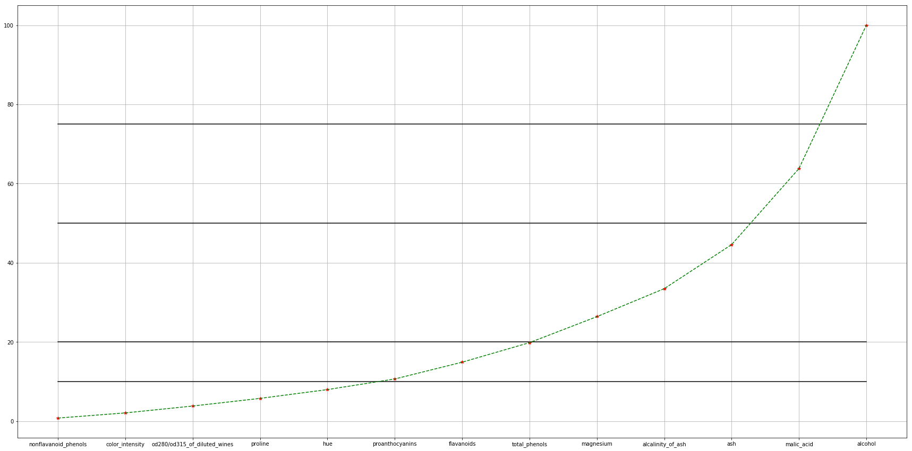
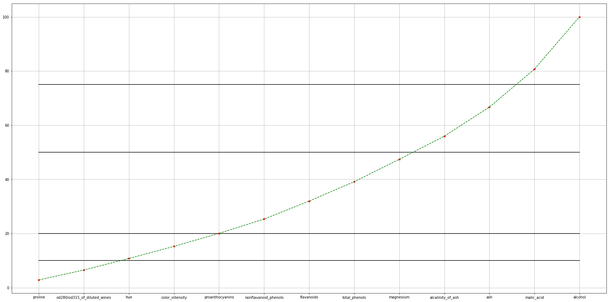
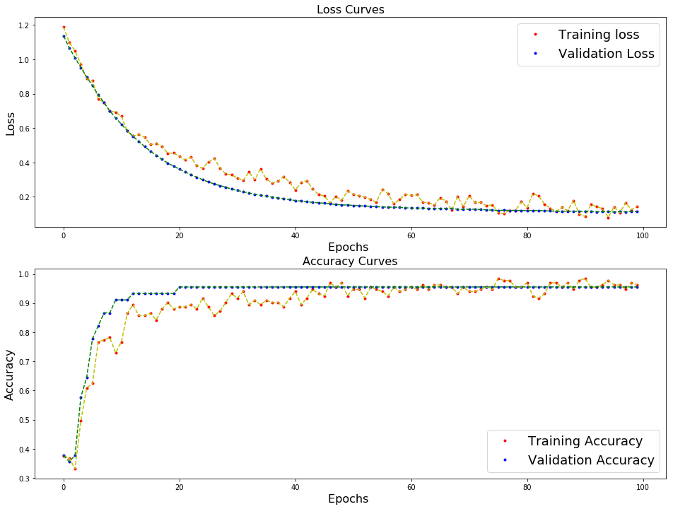
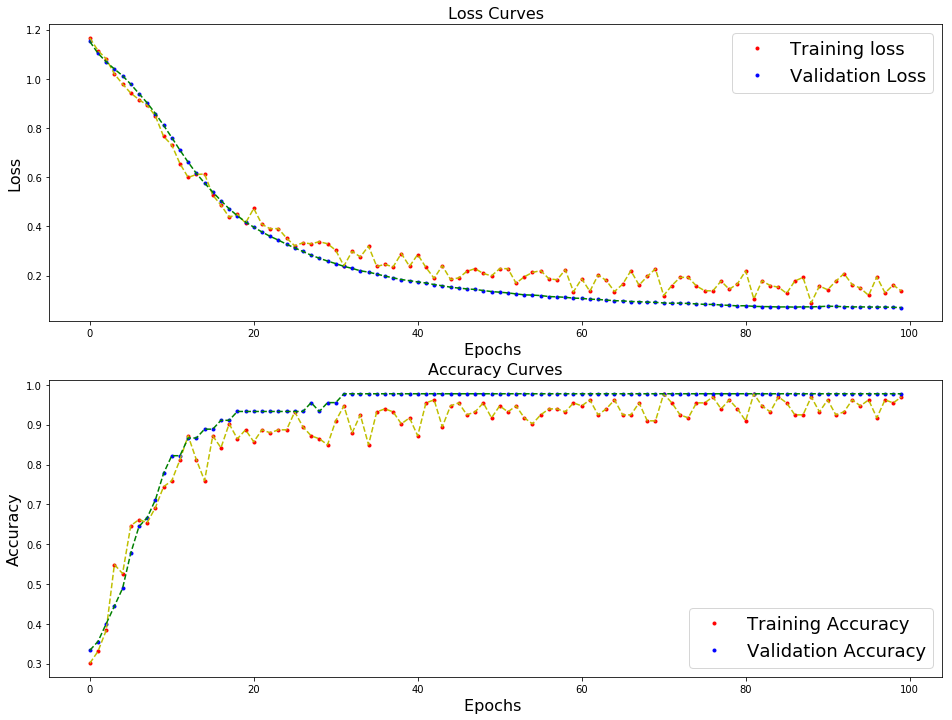
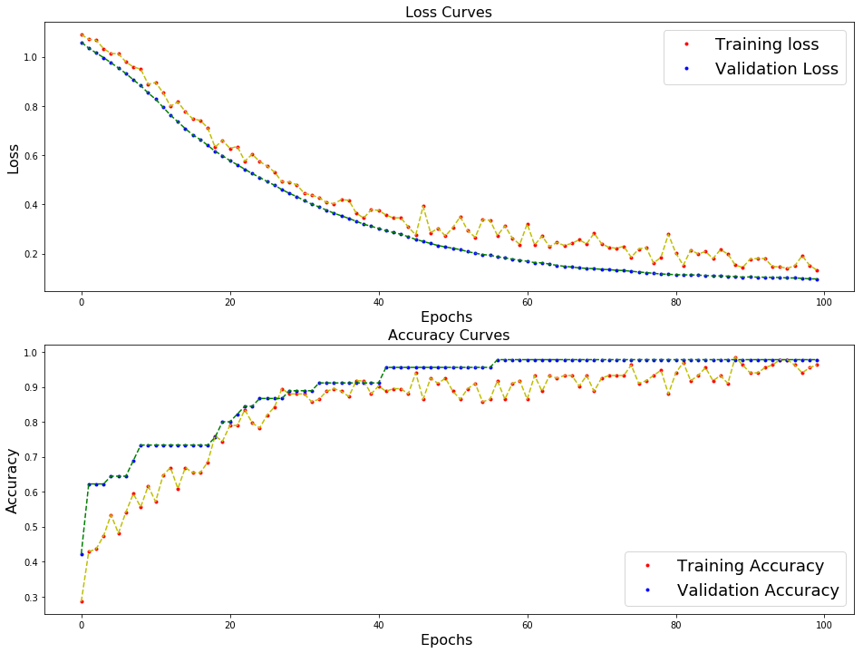

# Comparativa Principal Component Analysis Clasico e Principal Component Analysis rede adaptativa - Wine 

Autor:

- **Jeffri Erwin Murrugarra Llerena**
    * *USP #* **10655837** 
    

- **Jahir Gilbert Medina Llerena**
    * *USP #* **10659682**    
    
## Resumo
   
   Implementação da técnica PCA clasico e PCA con rede adaptativo no conjunto de dados Wine.

## Apresentação
   
   - **Wine** : Estes dados são os resultados de uma análise química de vinhos cultivados na mesma região na Itália, mas derivados de três diferentes cultivares. A análise determinou as quantidades de 13 constituintes encontrados em cada um dos três tipos de vinhos.
   
   - **PCA Clasico** : É um procedimento estatístico que usa uma transformação ortogonal para converter um conjunto de observações de variáveis possivelmente correlacionadas em um conjunto de valores de variáveis linearmente não correlacionadas, chamadas componentes principais.
   
   - **PCA con regra Hebbiana Generalizada** : É um modelo de rede neural feedforward linear para aprendizado não supervisionado com aplicações principalmente na análise de componentes principais é semelhante à regra de Oja em sua formulação e estabilidade, exceto que ele pode ser aplicado a redes com múltiplas saídas.

## Descrição de atividades

### Pre Procesamiento
   -  Padronize os dados X_i para estes tenham média igual a 0 e variância igual a 1

### PCA clasico

   - Foi calculado a matrix de covariância e calculo - se os autovetores e autovalores
   
### PCA adaptativo
   
   - Foi feito uma rede não supervisionada 13x13 con regra hebbiana generalizada para o aprendizado
   
### Test

   - Foi feito a reducão de dimensionalidade baseado em um corte de un 20% da suma acumulativa da responsabilidade da variância
   
   - Foi feito MLP 13x5x13(sem PCA),6x5x13(PCA clásico),8x5x13(PCA adaptativo), con funcão de ativação relu,hard_sigmoid,softmax e um dropout de 0.2,0.1
   
   - Foi particionada a data em 75% para treinamento e 25% para teste
   
## Resultados

### Responsabilidade na variância PCA clásica ###

| PCA                          | Responsabilidade |
|------------------------------|------------------|
| alcohol                      | 36.1988 %        |
| malic_acid                   | 19.2075 %        |
| ash                          | 11.1236 %        |
| alcalinity_of_ash            | 7.0690  %        |
| magnesium                    | 6.5633  %        |
| total_phenols                | 4.9358  %        |
| flavanoids                   | 4.2387  %        |
| proanthocyanins              | 2.6807  %        |
| hue                          | 2.2222  %        |
| proline                      | 1.9300  %        |
| od280/od315_of_diluted_wines | 1.7368  %        |
| color_intensity              | 1.2982  %        |
| nonflavanoid_phenols         | 0.7952  %        |

### Responsabilidade na variância PCA adaptativo ###

| PCA                               | Responsabilidade |
|-----------------------------------|------------------|
| alcohol                           | 19.3298  %       |
| malic_acid                        | 13.9863  %       |
| ash                               | 10.7350  %       |
| alcalinity_of_ash                 | 8.5581   %       |
| magnesium                         | 8.2515   %       |
| total_phenols                     | 7.1563   %       |
| flavanoids                        | 6.6368   %       |
| nonflavanoid_phenols              | 5.2762   %       |
| proanthocyanins                   | 4.8013   %       |
| color_intensity                   | 4.4743   %       |
| hue                               | 4.2474   %       |
| od280/od315_of_diluted_wines      | 3.6723   %       |
| proline                           | 2.8747   %       |

### Reducão de dimensionalidade ###

#### PCA clásico ####
 

#### PCA adaptativo ####

### Resultados do dataset wine ###

#### Sem PCA ####

#### PCA clásico ####

#### PCA adaptativo ####

## Conclusões

  - Na redução de dimensionalidade com o PCA clasico foi obtido um 85.098 % de representatividade dos dados, enquanto com o PCA adaptativo foi obtido um 79.9267 % de representatividade dos dados
  
  - É observavel que a acurácia dos modelos e parecida, Sem PCA(), PCA clásico(),PCA adaptativo()
